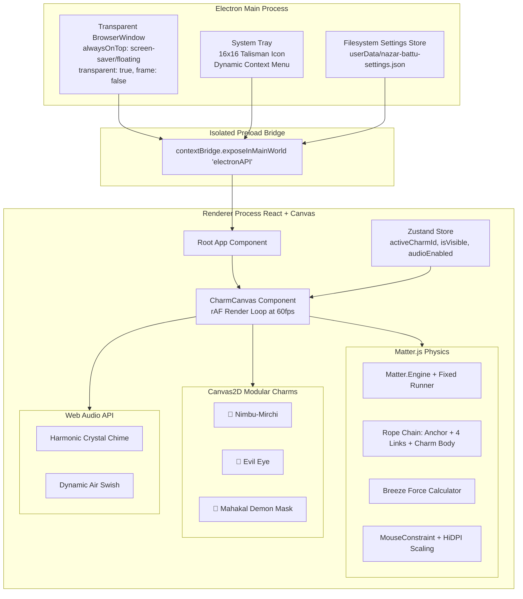

# System Architecture — Nazar Battu

```mermaid
graph TD
    subgraph MainProcess [Electron Main Process]
        Win[Transparent BrowserWindow<br/>alwaysOnTop: screen-saver/floating<br/>transparent: true, frame: false]
        TrayComp[System Tray<br/>16x16 Talisman Icon<br/>Dynamic Context Menu]
        Store[Filesystem Settings Store<br/>userData/nazar-battu-settings.json]
    end

    subgraph PreloadBridge [Isolated Preload Bridge]
        ContextBridge[contextBridge.exposeInMainWorld 'electronAPI']
    end

    subgraph RendererProcess [Renderer Process React + Canvas]
        App[Root App Component]
        StoreZ[Zustand Store<br/>activeCharmId, isVisible, audioEnabled]
        Canvas[CharmCanvas Component<br/>rAF Render Loop at 60fps]
        
        subgraph PhysicsEngine [Matter.js Physics]
            Engine[Matter.Engine + Fixed Runner]
            Rope[Rope Chain: Anchor + 4 Links + Charm Body]
            Breeze[Breeze Force Calculator]
            MouseConst[MouseConstraint + HiDPI Scaling]
        end

        subgraph ModularCharms [Canvas2D Modular Charms]
            Nimbu[🍋 Nimbu-Mirchi]
            EvilEye[🧿 Evil Eye]
            Mahakal[👹 Mahakal Demon Mask]
        end

        subgraph AudioSynth [Web Audio API]
            Chime[Harmonic Crystal Chime]
            Swish[Dynamic Air Swish]
        end
    end

    Win --> ContextBridge
    TrayComp --> ContextBridge
    Store --> ContextBridge
    ContextBridge --> App
    App --> Canvas
    Canvas --> PhysicsEngine
    Canvas --> ModularCharms
    Canvas --> AudioSynth
    StoreZ --> Canvas
```
