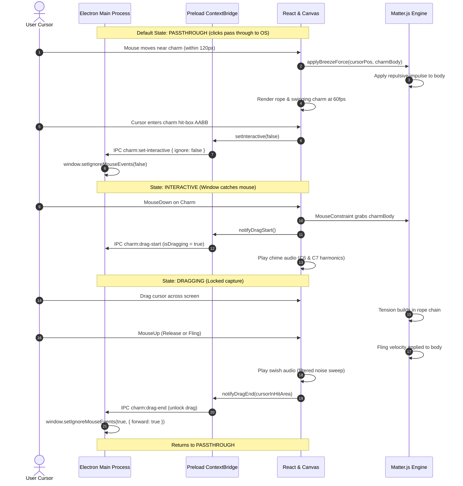

# Interaction & Event Flows — Nazar Battu

```mermaid
sequenceDiagram
    autonumber
    actor User as User Cursor
    participant Main as Electron Main Process
    participant Preload as Preload ContextBridge
    participant Renderer as React & Canvas
    participant Physics as Matter.js Engine

    Note over Main,Renderer: Default State: PASSTHROUGH (clicks pass through to OS)

    User->>Renderer: Mouse moves near charm (within 120px)
    Renderer->>Physics: applyBreezeForce(cursorPos, charmBody)
    Physics->>Physics: Apply repulsive impulse to body
    Renderer->>Renderer: Render rope & swinging charm at 60fps

    User->>Renderer: Cursor enters charm hit-box AABB
    Renderer->>Preload: setInteractive(false)
    Preload->>Main: IPC charm:set-interactive { ignore: false }
    Main->>Main: window.setIgnoreMouseEvents(false)
    Note over Main,Renderer: State: INTERACTIVE (Window catches mouse)

    User->>Renderer: MouseDown on Charm
    Renderer->>Physics: MouseConstraint grabs charmBody
    Renderer->>Preload: notifyDragStart()
    Preload->>Main: IPC charm:drag-start (isDragging = true)
    Renderer->>Renderer: Play chime audio (C6 & C7 harmonics)
    Note over Main,Renderer: State: DRAGGING (Locked capture)

    User->>Renderer: Drag cursor across screen
    Physics->>Physics: Tension builds in rope chain

    User->>Renderer: MouseUp (Release or Fling)
    Physics->>Physics: Fling velocity applied to body
    Renderer->>Renderer: Play swish audio (filtered noise sweep)
    Renderer->>Preload: notifyDragEnd(cursorInHitArea)
    Preload->>Main: IPC charm:drag-end (unlock drag)
    Main->>Main: window.setIgnoreMouseEvents(true, { forward: true })
    Note over Main,Renderer: Returns to PASSTHROUGH
```
