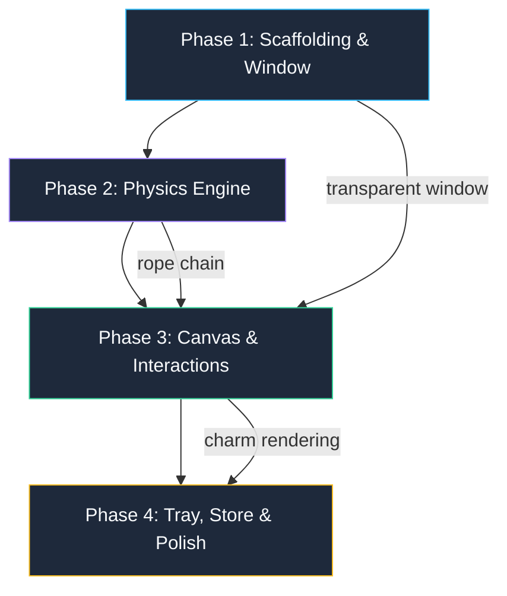

# 📋 Nazar Battu — Implementation Plan

> **Version**: 1.0  
> **Status**: Draft — Awaiting Approval  
> **Last Updated**: 2026-09-04  
> **Maps to**: `/speckit.plan` & `/speckit.tasks`

---

## Goal

Build a transparent, always-on-top Electron desktop companion that renders a physics-based dangling talisman (nimbu-mirchi) anchored to the top-center of the user's primary monitor, with cursor-reactive breeze, grab-and-fling mechanics, and system tray integration.

---

## User Review Required

> [!IMPORTANT]
> **Tailwind CSS version**: User requested Tailwind CSS. The plan uses **Tailwind CSS v4** (the latest). Please confirm this is acceptable, or specify v3 if needed.

> [!IMPORTANT]
> **Scaffolding tool**: Plan uses `electron-vite` (unified Vite config for Electron). An alternative is `electron-forge` with Vite plugin. `electron-vite` is lighter and more Vite-native.

> [!WARNING]
> **macOS accessibility permissions**: The `setIgnoreMouseEvents(true, { forward: true })` API may require accessibility permissions on macOS for reliable mouse event forwarding. The implementation will include a first-launch permission dialog. This has no impact on Windows.

---

## Open Questions

> [!IMPORTANT]
> 1. **Charm artwork fidelity**: Should the nimbu-mirchi be rendered as programmatic Canvas shapes (circles, curves, beziers) or as pre-drawn SVG assets loaded into the canvas? Programmatic = more flexible; SVG = richer detail.
> 2. **Rope visual style**: Should the rope be rendered as a thin thread (1-2px line), a braided cord texture, or invisible (charm floats)?
> 3. **Monitor selection**: If the user has multiple monitors, should we auto-detect the primary or let them pick from tray menu?

---

## Proposed Changes

The implementation is divided into **4 phases**, ordered by dependency graph. Each phase produces a verifiable, testable milestone.

---

### Phase 1: Project Scaffolding & Transparent Window 
**Estimated effort**: ~2 hours  
**Dependencies**: None

#### [NEW] Project root scaffolding

Scaffold a new Electron + Vite + React + TypeScript project using `electron-vite`:
- `npx electron-vite create ./ --template react-ts`
- Configure `electron.vite.config.ts` for main/preload/renderer
- Install dependencies: `matter-js`, `zustand`, `electron-store`, `tailwindcss`
- Set up TypeScript configs for all three processes

#### [NEW] [`src/main/index.ts`](file:///s:/nazar%20battu/src/main/index.ts)
- Create `BrowserWindow` with transparent, frameless, alwaysOnTop, skipTaskbar config
- Position window to cover primary display work area using `screen.getPrimaryDisplay()`
- Call `setIgnoreMouseEvents(true, { forward: true })` as default state
- Register IPC handlers (initially stubs)

#### [NEW] [`src/preload/index.ts`](file:///s:/nazar%20battu/src/preload/index.ts)
- Expose `electronAPI` via `contextBridge.exposeInMainWorld()`
- Define typed API: `setInteractive()`, `notifyDragStart()`, `notifyDragEnd()`
- Add listeners: `onToggleVisibility()`, `onChangeCharm()`

#### [NEW] [`src/renderer/src/styles/index.css`](file:///s:/nazar%20battu/src/renderer/src/styles/index.css)
- Tailwind CSS base imports
- `html, body { background: transparent; overflow: hidden; margin: 0; padding: 0; }`
- Disable all scrollbars and text selection

#### Verification
- [ ] `npm run dev` launches a transparent, frameless window covering the full screen
- [ ] Clicking anywhere on the transparent area passes through to desktop/apps below
- [ ] Window has no visible background, borders, or chrome
- [ ] Window persists across virtual desktop switches (macOS)

---

### Phase 2: Matter.js Physics Engine & Rope Chain
**Estimated effort**: ~3 hours  
**Dependencies**: Phase 1

#### [NEW] [`src/renderer/src/physics/engine.ts`](file:///s:/nazar%20battu/src/renderer/src/physics/engine.ts)
- Create and configure Matter.js `Engine` with custom gravity `{ x: 0, y: 1.5 }`
- Set up `Runner` with fixed timestep for deterministic physics
- Export engine instance and update function

#### [NEW] [`src/renderer/src/physics/rope.ts`](file:///s:/nazar%20battu/src/renderer/src/physics/rope.ts)
- Create static anchor body at `(window.innerWidth / 2, 0)`
- Generate 3-4 invisible circular link bodies (r=2, mass=0.1, airFriction=0.04)
- Chain bodies with `Constraint` objects (stiffness=0.9, length=30px, damping=0.05)
- Create charm body (rectangle, mass=5) and attach to last link
- Return composite containing all bodies and constraints

#### [NEW] [`src/renderer/src/physics/breeze.ts`](file:///s:/nazar%20battu/src/renderer/src/physics/breeze.ts)
- `applyBreezeForce(cursorPos, charmBody)` — proximity-based force calculation
- Inverse-distance scaling within 200px radius
- Direction vector pushes charm away from cursor
- Reduced vertical component (0.3x) for natural lateral sway

#### [NEW] [`src/renderer/src/physics/types.ts`](file:///s:/nazar%20battu/src/renderer/src/physics/types.ts)
- `PhysicsConfig` interface with all tunable constants
- `RopeChain` type containing bodies, constraints, and anchor reference
- Export default config values

#### [NEW] [`src/renderer/src/hooks/usePhysics.ts`](file:///s:/nazar%20battu/src/renderer/src/hooks/usePhysics.ts)
- React hook managing Matter.js engine lifecycle
- Initialize engine, create rope chain, start runner on mount
- Cleanup engine and runner on unmount
- Expose: `engine`, `ropeChain`, `charmBody`, `applyBreeze()`

#### Verification
- [ ] Physics engine creates rope chain with 4 segments
- [ ] Charm body swings and settles under gravity (visually verify via Matter.js debug renderer)
- [ ] Console-log charm body position updates at 60fps
- [ ] Air friction dampens oscillation — charm settles within 3-5 seconds

---

### Phase 3: Canvas Rendering & Mouse Interactions
**Estimated effort**: ~4 hours  
**Dependencies**: Phase 2

#### [NEW] [`src/renderer/src/charms/types.ts`](file:///s:/nazar%20battu/src/renderer/src/charms/types.ts)
- `CharmDefinition` interface: id, name, bodyShape, bodyDimensions, mass, render function
- `CharmRenderContext` type with canvas context, body position, angle

#### [NEW] [`src/renderer/src/charms/nimbu-mirchi.ts`](file:///s:/nazar%20battu/src/renderer/src/charms/nimbu-mirchi.ts)
- Programmatic Canvas rendering of the nimbu-mirchi talisman
- Yellow ellipse (lemon) + 7 green curved paths (chilies) + thin thread
- All shapes rotate and translate based on Matter.js body transform
- Export as `CharmDefinition` implementation

#### [NEW] [`src/renderer/src/charms/index.ts`](file:///s:/nazar%20battu/src/renderer/src/charms/index.ts)
- Charm registry: `Map<string, CharmDefinition>`
- Register `nimbu-mirchi` as default
- `getCharm(id)` and `listCharms()` exports

#### [NEW] [`src/renderer/src/components/CharmCanvas.tsx`](file:///s:/nazar%20battu/src/renderer/src/components/CharmCanvas.tsx)
- Full-window `<canvas>` element with transparent background
- `requestAnimationFrame` render loop:
  1. Clear canvas (transparent)
  2. Draw rope segments (lines between link body positions)
  3. Draw charm using active `CharmDefinition.render()` with body transform
- Hit-test logic: compute AABB from charm body position + padding
- Mouse event handlers:
  - `mousemove`: hit-test → IPC toggle + breeze force application
  - `mousedown`: attach `MouseConstraint` → IPC `drag-start`
  - `mouseup`: detach constraint → IPC `drag-end`
- Cursor style: `default` → `grab` → `grabbing` based on state

#### [NEW] [`src/renderer/src/hooks/useHitTest.ts`](file:///s:/nazar%20battu/src/renderer/src/hooks/useHitTest.ts)
- Compute axis-aligned bounding box from charm body position + dimensions + padding
- Debounced IPC calls (max 1 per rAF frame)
- 10px hysteresis zone to prevent rapid toggle at edge
- `isDragging` flag to lock interactive state during drag

#### [MODIFY] [`src/main/index.ts`](file:///s:/nazar%20battu/src/main/index.ts)
- Wire up IPC handlers for `charm:set-interactive`, `charm:drag-start`, `charm:drag-end`
- Implement `isDragging` flag in main process for safety

#### [MODIFY] [`src/renderer/src/App.tsx`](file:///s:/nazar%20battu/src/renderer/src/App.tsx)
- Mount `CharmCanvas` component as root
- Connect to Zustand store for active charm, visibility state
- Conditionally render based on `isVisible`

#### Verification
- [ ] Nimbu-mirchi charm renders visually at screen center, dangling from top
- [ ] Rope segments visible as thin lines connecting link positions
- [ ] Charm swings with physics — grab and fling works
- [ ] Cursor changes to `grab`/`grabbing` over charm
- [ ] Clicking outside charm bounding box passes through to desktop
- [ ] Hover breeze gently pushes charm when cursor passes nearby
- [ ] No flickering or state-machine race conditions at hit-area boundary

---

### Phase 4: System Tray, Zustand Store & Polish
**Estimated effort**: ~2 hours  
**Dependencies**: Phase 3

#### [NEW] [`src/main/tray.ts`](file:///s:/nazar%20battu/src/main/tray.ts)
- Create system tray icon using `Tray` class
- Build context menu: Show/Hide, Charm submenu (Nimbu-Mirchi checked), Separator, Quit
- IPC to renderer on menu selection: `tray:toggle-visibility`, `tray:change-charm`
- Double-click handler toggles visibility

#### [NEW] [`src/main/store.ts`](file:///s:/nazar%20battu/src/main/store.ts)
- `electron-store` instance with schema validation
- Persist: `activeCharmId`, `isVisible`, `audioEnabled`, `ropeLength`, `swayIntensity`
- Read on startup, write on change via IPC

#### [NEW] [`src/renderer/src/store/useStore.ts`](file:///s:/nazar%20battu/src/renderer/src/store/useStore.ts)
- Zustand store implementing `NazarBattuStore` interface from TRD
- `activeCharmId`, `isVisible`, `interactionState`, `charmPosition`, `charmAngle`
- Actions: `setActiveCharm()`, `toggleVisibility()`, `setInteractionState()`, `updateCharmTransform()`

#### [NEW] [`src/renderer/src/components/TrayToggle.tsx`](file:///s:/nazar%20battu/src/renderer/src/components/TrayToggle.tsx)
- Small floating toggle button positioned near the charm anchor
- Click toggles charm visibility
- Has its own hit-area for IPC interactive toggle
- Subtle opacity transition on hover

#### [MODIFY] [`src/renderer/src/components/CharmCanvas.tsx`](file:///s:/nazar%20battu/src/renderer/src/components/CharmCanvas.tsx)
- Add ambient sway: small random force applied at low frequency when idle
- Connect to Zustand store for `isVisible` and `activeCharmId`
- Pause/resume physics engine based on visibility

#### Polish Tasks
- Add `cursor: grab` and `cursor: grabbing` CSS classes
- Ensure transparent body has `user-select: none` and `-webkit-app-region: no-drag`
- Test idle CPU usage — throttle physics when no interaction for 5+ seconds
- Add graceful error boundaries around canvas rendering

#### Verification
- [ ] System tray icon appears with correct context menu
- [ ] Show/Hide toggle from tray works
- [ ] Charm selection persists across app restart
- [ ] Floating mini-toggle button works
- [ ] Ambient sway visible when charm is idle
- [ ] CPU usage < 2% when idle (throttled physics)
- [ ] Memory < 80MB RSS

---

## Verification Plan

### Automated Tests
```bash
# Type checking
npx tsc --noEmit

# Build verification
npm run build

# Lint
npm run lint
```

### Manual Verification
- [ ] Launch on Windows 10+: transparent window, click-through, charm dangling
- [ ] Grab and fling charm — physics feel natural
- [ ] Hover breeze — cursor near charm causes gentle sway
- [ ] System tray: show/hide, quit
- [ ] Task Manager: CPU < 2% at idle, RSS < 80MB
- [ ] Alt-Tab: Nazar Battu does NOT appear in switcher
- [ ] Clicking desktop icons/taskbar through the transparent window works 100%
- [ ] Rapid mouse movement across hit-area boundary: no flickering

### macOS-Specific (Phase 1 stretch)
- [ ] Accessibility permission dialog shown on first launch
- [ ] Charm visible across Mission Control spaces
- [ ] No window shadow artifacts

---

## Dependency Graph



---

## Session Handoff

1. **Completed**: PRD, TRD, and IMPLEMENTATION_PLAN created in `/docs`
2. **Architecture validated**: IPC mouse-event state machine verified via `sequential-thinking` (5-step chain)
3. **API confirmed**: `setIgnoreMouseEvents(true, { forward: true })` behavior verified via `context7` Electron docs
4. **Next step**: User approval → execute Phase 1 scaffolding
5. **Watch out for**: macOS `forward: true` may need accessibility permissions; Tailwind v4 vs v3 confirmation needed
